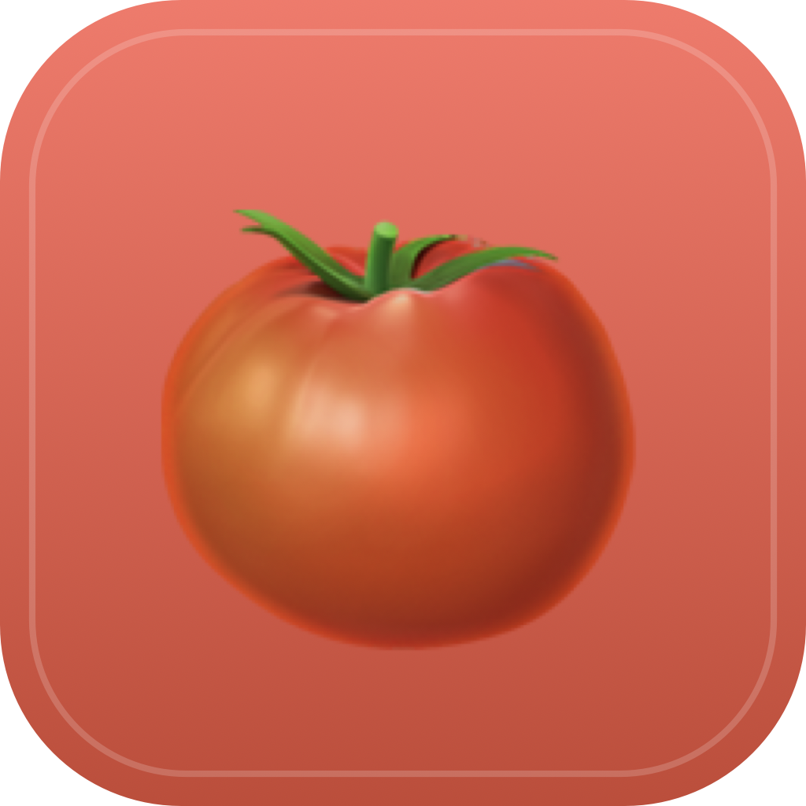

<div align="center">
  

# Pomodoro

**A tiny, native macOS menu bar Pomodoro timer.**

~176 KB binary · ~1.5 MB DMG · No Electron · Open source · MIT license

[English](#english) · [Türkçe](#türkçe)

</div>

---

## English

A focused Pomodoro timer that lives in your macOS menu bar. Built natively in Swift with a WebKit-rendered UI — combining the design flexibility of HTML/CSS with the lightness and feel of a native macOS app.

### Features

- 🍅 **Live countdown in the status bar** (`🍅 24:57`)
- ⏱️ **Three modes** with customizable durations: Work / Short Break / Long Break
- ⌨️ **Global hotkey** `⌘⇧P` toggles the popover from anywhere
- 🔔 **Three completion signals** — system sound, Turkish text-to-speech, native macOS notification (each can be toggled)
- 🚀 **Auto-start at login** via macOS `SMAppService` (one click in the right-click menu)
- 💾 **Persistent settings** — your durations and toggles survive restarts
- 🌑 **Dark mode by default** — Linear/Vercel-style minimal dark theme
- 📐 **~176 KB binary, ~1.5 MB DMG** — for comparison, an Electron equivalent would weigh ~150 MB

### Installation

#### Option 1: Download the DMG (recommended for users)

1. Download `Pomodoro-0.1.0.dmg` from [Releases](https://github.com/onurdilmen/pomodoro-menubar/releases)
2. Open the DMG and drag **Pomodoro** to **Applications**
3. **First launch:** macOS will block the app because it's not signed by an Apple-verified developer. Right-click `Pomodoro.app` → **Open** → click **Open** in the dialog. You only need to do this once.
4. The app appears in your menu bar as `🍅 25:00`. **Left-click** to open the timer; **right-click** for settings.

> **Why the warning?** This app is not signed with a paid Apple Developer ID ($99/year). The code is open source and you can audit it. After the first manual approval, macOS remembers your decision.

#### Option 2: Build from source

Requires macOS 13+ and Xcode Command Line Tools (no full Xcode needed).

```bash
git clone https://github.com/onurdilmen/pomodoro-menubar.git
cd pomodoro-menubar
./package.sh --install
```

This builds the app, generates the icon, copies to `/Applications/`, and launches it.

### Keyboard shortcuts

| Shortcut | Action                                  |
| -------- | --------------------------------------- |
| `⌘⇧P`    | Toggle popover (works globally)         |
| `Space`  | Start / Pause (when popover is focused) |
| `R`      | Reset (when popover is focused)         |
| `⌘Q`     | Quit (from menu)                        |

### Right-click menu

Right-click the menu bar icon to access:

- **Durations**: Work (15–90 min), Short Break (3–15 min), Long Break (10–30 min)
- **Notifications**: System sound, Turkish text-to-speech, Mac notification (each toggleable)
- **Test notification**: trigger all three at once
- **Auto-start at login**: enable / disable
- **Quit**: ⌘Q

### Architecture

Hybrid native shell + WebKit content — same pattern used by Notion, Slack, GitHub Desktop, and Stripe (but much lighter).

```
┌─────────────────────────────────┐
│  macOS menu bar (NSStatusItem)  │
└────────────────┬────────────────┘
                 │
        ┌────────▼────────┐
        │   NSPopover     │
        └────────┬────────┘
                 │
        ┌────────▼────────┐
        │    WKWebView    │  ← Linear/Vercel-style HTML UI
        └─────────────────┘
                 │
                 │ MutationObserver → WKScriptMessageHandler
                 │
            ┌────▼────────────────────────┐
            │  Native: NSSound,           │
            │  AVSpeechSynthesizer,       │
            │  UNUserNotificationCenter,  │
            │  Carbon RegisterEventHotKey │
            └─────────────────────────────┘
```

Key components:

- **`NSStatusItem` + `NSPopover`** — the native menu bar shell
- **`WKWebView`** — renders the HTML/CSS/JS UI (designed in [Open Design](https://github.com/nexu-io/open-design))
- **`WKScriptMessageHandler`** — bridges DOM events to Swift; status bar countdown is push-based via `MutationObserver` (not polling)
- **`AVSpeechSynthesizer`** — Turkish-first TTS (`tr-TR`, falls back to `en-US`)
- **`UNUserNotificationCenter`** — native macOS notifications (requires `.app` bundle, not just a binary)
- **`Carbon RegisterEventHotKey`** — system-wide `⌘⇧P` hotkey without requesting Accessibility permission
- **`SMAppService`** — modern macOS 13+ login items API

### Build commands

```bash
./package.sh                  # Release build + .app bundle
./package.sh --install        # build + copy to /Applications/ + restart
./package.sh --icon           # regenerate AppIcon.icns
./package.sh --dmg            # build + DMG installer
./package.sh --all            # icon + build + install + DMG
./package.sh -h               # help
```

The icon is generated programmatically from `icon-gen.swift` — no external image assets needed.

### License

MIT — see [LICENSE](LICENSE).

### Credits

- Pomodoro UI designed in **[Open Design](https://github.com/nexu-io/open-design)** (an open-source local-first alternative to Anthropic's Claude Design).
- Built with **Claude Code** as a pair-programming exercise — the entire Swift host, WebKit bridge, native completion engine, and packaging pipeline came together in a single afternoon.

---

## Türkçe

Menü çubuğunda yaşayan, native macOS Pomodoro zamanlayıcısı. Swift ile yazıldı, arayüz WebKit tarafından render ediliyor — HTML/CSS tasarım esnekliği + native uygulama hafifliği bir arada.

### Özellikler

- 🍅 **Menü çubuğunda canlı geri sayım** (`🍅 24:57`)
- ⏱️ **Üç mod**: Çalışma / Kısa Mola / Uzun Mola — süreler özelleştirilebilir
- ⌨️ **Global kısayol** `⌘⇧P` her yerden popover'ı aç/kapat
- 🔔 **Üç tip bildirim** — sistem sesi, Türkçe sesli okuma, macOS native bildirim (her biri açıp/kapanabilir)
- 🚀 **Mac açılışında otomatik başlat** — sağ tık menüsünden tek tıkla
- 💾 **Tercihler kalıcı** — süre ve toggle ayarları yeniden başlatmadan sonra korunur
- 🌑 **Koyu tema** — Linear/Vercel tarzı minimal koyu arayüz
- 📐 **~176 KB binary, ~1.5 MB DMG** — Electron alternatifi olsa ~150 MB olurdu

### Kurulum

1. [Releases](https://github.com/onurdilmen/pomodoro-menubar/releases) sayfasından `Pomodoro-0.1.0.dmg` indir
2. DMG'yi aç, **Pomodoro**'yu **Applications**'a sürükle
3. **İlk açılışta:** macOS uyarı verir ("doğrulanmış geliştirici değil" gibi). Bu uygulama Apple Developer ID ile imzalı olmadığı için. Çözüm: `Pomodoro.app`'e sağ tık → **Aç** → açılan diyalogta **Aç** tıkla. Sadece ilk seferinde gerekli.
4. Menü çubuğunda `🍅 25:00` görünür. **Sol tık** → zamanlayıcı; **sağ tık** → ayarlar.

### Kaynak koddan derle

```bash
git clone https://github.com/onurdilmen/pomodoro-menubar.git
cd pomodoro-menubar
./package.sh --install
```

### Lisans

MIT — bkz. [LICENSE](LICENSE).
